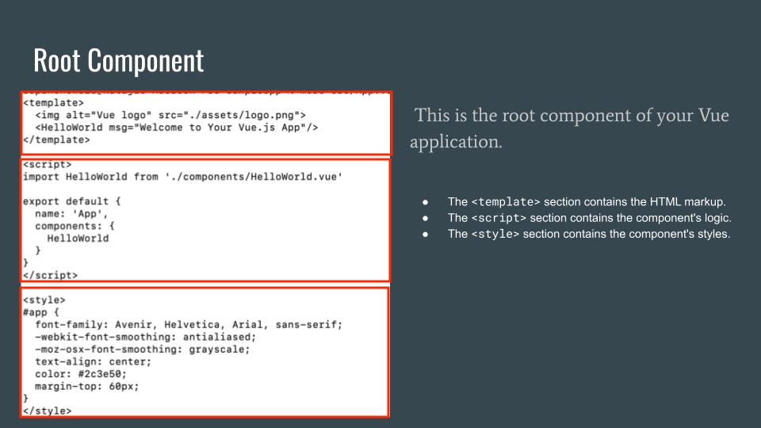

- [Session 2. Introduction to Course](#)
        - [What is Vue3?](#)

# Session . Introduction to Course

Open Terminal
Run the command 

```
%npm install -g @vue/cli
```

Verify the installation by running 

```
%vue --version
@vue/cli 5.0.8

```

Now start the Sample Application 

```
%vue create sampleapp 

Vue CLI v5.0.8
? Please pick a preset: (Use arrow keys)
❯ Default ([Vue 3] babel, eslint) 
  Default ([Vue 2] babel, eslint) 
  Manually select features 


Vue CLI v5.0.8
✨  Creating project in /Users/sopanshewale/learning/vue3django/session2/front-end/sampleapp.
🗃  Initializing git repository...
⚙️  Installing CLI plugins. This might take a while...

(⠂⠂⠂⠂⠂⠂⠂⠂⠂⠂⠂⠂⠂⠂⠂⠂⠂⠂) ⠴ idealTree:sampleapp: sill idealTree buildDeps


Vue CLI v5.0.8
✨  Creating project in /Users/sopanshewale/learning/vue3django/session2/front-end/sampleapp.
🗃  Initializing git repository...
⚙️  Installing CLI plugins. This might take a while...


added 872 packages, and audited 873 packages in 30s

100 packages are looking for funding
  run `npm fund` for details

4 moderate severity vulnerabilities

To address issues that do not require attention, run:
  npm audit fix

To address all issues (including breaking changes), run:
  npm audit fix --force

Run `npm audit` for details.
🚀  Invoking generators...
📦  Installing additional dependencies...


added 89 packages, and audited 962 packages in 6s

112 packages are looking for funding
  run `npm fund` for details

4 moderate severity vulnerabilities

To address all issues (including breaking changes), run:
  npm audit fix --force

Run `npm audit` for details.
⚓  Running completion hooks...

📄  Generating README.md...

🎉  Successfully created project sampleapp.
👉  Get started with the following commands:

 $ cd sampleapp
 $ npm run serve


```

After that 

```
%cd sampleapp 
%npm run serve


  App running at:
  - Local:   http://localhost:8080/ 
  - Network: http://192.168.0.101:8080/

  Note that the development build is not optimized.
  To create a production build, run npm run build.


```

This starts the Vue3 Application. You can access https://localhost:8080/ in browser, it shows the default Application. 


# Creating a Vue Instance

Open ``` src/main.js``` , you will see the following code

```

import { createApp } from 'vue'
import App from './App.vue'
createApp(App).mount('#app')

```

This code imports createApp from vue, also imports the root component (App.vue), 
The code creates the Vue instance and mounts that on DOM element with the id "app" 


# Root Component of the Vue 




#  Hello Vue3 

Copy the following code at ```src/App.vue``` 
(you can also copy ```src/App.vue.1``` to ```src/App.vue```) 

```

<template>
  <div id="app">
    <h1>{{ message }}</h1>
  </div>
</template>

<script>
export default {
  data() {
    return {
      message: 'Hello, Vue 3!'
    }
  }
}
</script>

<style>
#app {
  font-family: Avenir, Helvetica, Arial, sans-serif;
  -webkit-font-smoothing: antialiased;
  -moz-osx-font-smoothing: grayscale;
  text-align: center;
  color: #2c3e50;
  margin-top: 60px;
}
</style>

```

At browser you can see following: 


# Key Properties and Methods

Let's explore some of the key properties and methods of a Vue instance.

* Data
 - Data properties are reactive, meaning Vue will react to changes and update the DOM accordingly
*Methods
 - Methods are functions defined within the component that can be called from the template or other parts of the component.
* Computed Properties
 - Computed properties are cached based on their dependencies and only re-evaluate when those dependencies change.

copy the  the following code in ```src/App.vue```:
(The code is alway available in ```src/App.vue.2```)
 


```

<template>

<div id="app">
    <h1>{{ message }}</h1>
    <p>Counter: {{ counter }}</p>
    <button @click="incrementCounter">Increment</button>
  </div>

</template>

<script>

export default {
  data() {
    return {
      message: 'Hello, Vue 3!',
      counter: 0
    }
  },
  methods: {
    incrementCounter() {
      this.counter++;
    }
  }
}


</script>

<style>
#app {
  font-family: Avenir, Helvetica, Arial, sans-serif;
  -webkit-font-smoothing: antialiased;
  -moz-osx-font-smoothing: grayscale;
  text-align: center;
  color: #2c3e50;
  margin-top: 60px;
}
</style>

```


 
