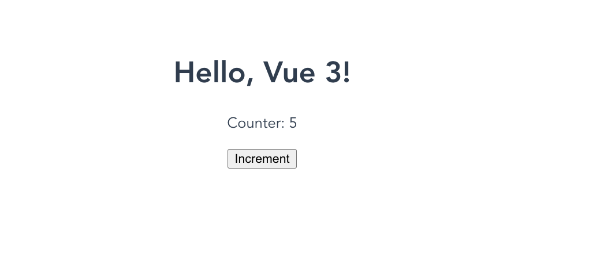

- [Session 2. Introduction to Course](#)
        - [What is Vue3?](#)

# Session . Introduction to Course

Open Terminal
Run the command 

```
%npm install -g @vue/cli
```

Verify the installation by running 

```
%vue --version
@vue/cli 5.0.8

```

Now start the Sample Application 

```
%vue create sampleapp 

Vue CLI v5.0.8
? Please pick a preset: (Use arrow keys)
❯ Default ([Vue 3] babel, eslint) 
  Default ([Vue 2] babel, eslint) 
  Manually select features 


Vue CLI v5.0.8
✨  Creating project in /Users/sopanshewale/learning/vue3django/session2/front-end/sampleapp.
🗃  Initializing git repository...
⚙️  Installing CLI plugins. This might take a while...

(⠂⠂⠂⠂⠂⠂⠂⠂⠂⠂⠂⠂⠂⠂⠂⠂⠂⠂) ⠴ idealTree:sampleapp: sill idealTree buildDeps


Vue CLI v5.0.8
✨  Creating project in /Users/sopanshewale/learning/vue3django/session2/front-end/sampleapp.
🗃  Initializing git repository...
⚙️  Installing CLI plugins. This might take a while...


added 872 packages, and audited 873 packages in 30s

100 packages are looking for funding
  run `npm fund` for details

4 moderate severity vulnerabilities

To address issues that do not require attention, run:
  npm audit fix

To address all issues (including breaking changes), run:
  npm audit fix --force

Run `npm audit` for details.
🚀  Invoking generators...
📦  Installing additional dependencies...


added 89 packages, and audited 962 packages in 6s

112 packages are looking for funding
  run `npm fund` for details

4 moderate severity vulnerabilities

To address all issues (including breaking changes), run:
  npm audit fix --force

Run `npm audit` for details.
⚓  Running completion hooks...

📄  Generating README.md...

🎉  Successfully created project sampleapp.
👉  Get started with the following commands:

 $ cd sampleapp
 $ npm run serve


```

After that 

```
%cd sampleapp 
%npm run serve


  App running at:
  - Local:   http://localhost:8080/ 
  - Network: http://192.168.0.101:8080/

  Note that the development build is not optimized.
  To create a production build, run npm run build.


```

This starts the Vue3 Application. You can access https://localhost:8080/ in browser, it shows the default Application. 


# Creating a Vue Instance

Open ``` src/main.js``` , you will see the following code

```

import { createApp } from 'vue'
import App from './App.vue'
createApp(App).mount('#app')

```

This code imports createApp from vue, also imports the root component (App.vue), 
The code creates the Vue instance and mounts that on DOM element with the id "app" 


# Root Component of the Vue 


#  Hello Vue3 

Copy the following code at ```src/App.vue``` 
(you can also copy ```src/App.vue.1``` to ```src/App.vue```) 

```

<template>
  <div id="app">
    <h1>{{ message }}</h1>
  </div>
</template>

<script>
export default {
  data() {
    return {
      message: 'Hello, Vue 3!'
    }
  }
}
</script>

<style>
#app {
  font-family: Avenir, Helvetica, Arial, sans-serif;
  -webkit-font-smoothing: antialiased;
  -moz-osx-font-smoothing: grayscale;
  text-align: center;
  color: #2c3e50;
  margin-top: 60px;
}
</style>

```

At browser you can see following: 


# Key Properties and Methods

Let's explore some of the key properties and methods of a Vue instance.

* Data: Data properties are reactive, meaning Vue will react to changes and update the DOM accordingly
* Methods: Methods are functions defined within the component that can be called from the template or other parts of the component.
* Computed Properties: Computed properties are cached based on their dependencies and only re-evaluate when those dependencies change.

copy the  the following code in ```src/App.vue```:
(The code is alway available in ```src/App.vue.2```)
 


```

<template>

<div id="app">
    <h1>{{ message }}</h1>
    <p>Counter: {{ counter }}</p>
    <button @click="incrementCounter">Increment</button>
  </div>

</template>

<script>

export default {
  data() {
    return {
      message: 'Hello, Vue 3!',
      counter: 0
    }
  },
  methods: {
    incrementCounter() {
      this.counter++;
    }
  }
}


</script>

<style>
#app {
  font-family: Avenir, Helvetica, Arial, sans-serif;
  -webkit-font-smoothing: antialiased;
  -moz-osx-font-smoothing: grayscale;
  text-align: center;
  color: #2c3e50;
  margin-top: 60px;
}
</style>

```

The front-end looks as follow:




# Lifesycle Hooks 

Copy the following code in ```src/App.vue```

```
<template>

 <div id="app">
    <p>{{ message }}</p>
  </div>
</template>

<script>


export default {
  data() {
    return {
      message: 'Hello, Vue 3!'
    }
  },
  created() {
    console.log('Component created');
  },
  mounted() {
    console.log('Component mounted');
  },
  updated() {
    console.log('Component updated');
  },
  beforeUnmount() {
    console.log('Component about to be unmounted');
  }
}


</script>

<style>
#app {
  font-family: Avenir, Helvetica, Arial, sans-serif;
  -webkit-font-smoothing: antialiased;
  -moz-osx-font-smoothing: grayscale;
  text-align: center;
  color: #2c3e50;
  margin-top: 60px;
}
</style>

```

The same code is available in ```src/App.vue.4``` too

You can see some of the logs inside browser console (go via inspect way in chrome) 
 


That's basics of understanding the Vue 3 instance. You learned how to create a Vue instance, explored its key properties and methods, and understood lifecycle hooks. These concepts form the foundation of any Vue application.

# Data Binding and Interpolation


Data binding and interpolation are fundamental concepts in Vue.js that allow you to dynamically display data in your templates.


## Interpolation

Copy the following code in ```src/App.vue```

```
<template>
  <div id="app">
    <h1>{{ message }}</h1>
  </div>
</template>

<script>
export default {
  data() {
    return {
      message: 'Hello, Vue 3!'
    }
  }
}
</script>

<style>
#app {
  font-family: Avenir, Helvetica, Arial, sans-serif;
  -webkit-font-smoothing: antialiased;
  -moz-osx-font-smoothing: grayscale;
  text-align: center;
  color: #2c3e50;
  margin-top: 60px;
}
</style>

```

In this example, the ```message``` data property is bound to the DOM using interpolation.

## Data Binding

Copy the following code in ```src/App.vue```

```

<template>
  <div id="app">
    <h1>{{ message }}</h1>
    <a v-bind:href="url">Visit Vue.js</a>
  </div>
</template>

<script>
export default {
  data() {
    return {
      message: 'Hello, Vue 3!',
      url: 'https://vuejs.org'
    }
  }
}
</script>

<style>
#app {
  font-family: Avenir, Helvetica, Arial, sans-serif;
  -webkit-font-smoothing: antialiased;
  -moz-osx-font-smoothing: grayscale;
  text-align: center;
  color: #2c3e50;
  margin-top: 60px;
}
</style>

```

Here, the ```v-bind:href``` directive binds the ```url``` data property to the ```href``` attribute of the anchor tag.

## Binding Data to Classes and Styles

Copy the following code in ```src/App.vue```

```
<template>
  <div id="app">
    <h1 :class="headingClass">{{ message }}</h1>
    <p :style="paragraphStyle">This is a styled paragraph.</p>
  </div>
</template>

<script>
export default {
  data() {
    return {
      message: 'Hello, Vue 3!',
      headingClass: 'heading',
      paragraphStyle: {
        color: 'blue',
        fontSize: '20px'
      }
    }
  }
}
</script>

<style>
.heading {
  color: red;
}
</style>


```

* The ```:class``` binding dynamically applies the ```headingClass``` to the ```<h1>``` element.
* The ```:style``` binding applies inline styles from the ```paragraphStyle``` object to the ```<p>``` element.

## Two-Way Data Binding with v-model

Copy the following code into ```src/App.vue```

```
<template>
  <div id="app">
    <h1>{{ message }}</h1>
    <input v-model="message" placeholder="Edit me">
  </div>
</template>

<script>
export default {
  data() {
    return {
      message: 'Hello, Vue 3!'
    }
  }
}
</script>

```

With ```v-model```, changes to the input field update the message data property, and vice versa.


# Directives: v-bind, v-model, v-if, v-for, v-show


Let's dive into a some of the essential ```Vue.js``` directives: ```v-bind```, ```v-model```, ```v-if```, ```v-for```, and ```v-show```.
## v-bind

Copy following code at ```src/App.vue```

```

<template>
  <div>
    <a v-bind:href="url">Visit Dravate Courses</a>
    <!-- Shorthand syntax -->
    <a :href="url">Visit Dravate Course</a>
  </div>
</template>

<script>
export default {
  data() {
    return {
      url: 'https://dravate.com/courses'
    };
  }
};
</script>

```


The v-bind directive is used to bind an attribute to an expression. This is often used to bind HTML attributes to Vue data properties.


## v-model

Copy the following code at ``` src/App.vue```

```

<template>
  <div>
    <input v-model="message" placeholder="Type a message">
    <p>The message is: {{ message }}</p>
  </div>
</template>

<script>
export default {
  data() {
    return {
      message: ''
    };
  }
};
</script>

```
The ```v-model``` directive creates a two-way binding on form input, textarea, and select elements. This is useful for handling user input.


##  v-if

The ```v-if``` directive is used to conditionally render a block. The block will only be rendered if the directive's expression returns a truthy value.

Copy the following code into ```src/App.vue```

```
<template>
  <div>
    <p v-if="seen">Now you see me</p>
    <button @click="toggleSeen">Toggle Seen</button>
  </div>
</template>

<script>
export default {
  data() {
    return {
      seen: true
    };
  },
  methods: {
    toggleSeen() {
      this.seen = !this.seen;
    }
  }
};
</script>

```


## v-for


The ```v-for```  directive is used to render a list of items by iterating over an array.


Copy the following code at ```src/App.vue```

```

<template>
  <div>
    <ul>
      <li v-for="(item, index) in items" :key="index">{{ item }}</li>
    </ul>
  </div>
</template>

<script>
export default {
  data() {
    return {
      items: ['Apple', 'Banana', 'Cherry']
    };
  }
};
</script>

```


## v-show


The ```v-show``` directive is similar to ```v-if```, but instead of conditionally rendering the element, it toggles the element's visibility using the display CSS property.

Copy the following code into ```src/App.vue```

```
<template>
  <div>
    <p v-show="visible">Now you see me</p>
    <button @click="toggleVisible">Toggle Visible</button>
  </div>
</template>

<script>
export default {
  data() {
    return {
      visible: true
    };
  },
  methods: {
    toggleVisible() {
      this.visible = !this.visible;
    }
  }
};
</script>


```


* ```v-bind:``` Binds an attribute to a dynamic value.
* ```v-model:``` Creates two-way binding for form inputs.
* ```v-if:``` Conditionally renders elements.
* ```v-for:``` Renders a list of items.
* ```v-show:``` Toggles the visibility of an element.
These directives are fundamental to working with Vue.js and can be combined to create dynamic and interactive user interfaces.


